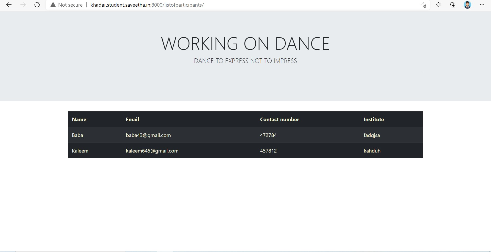
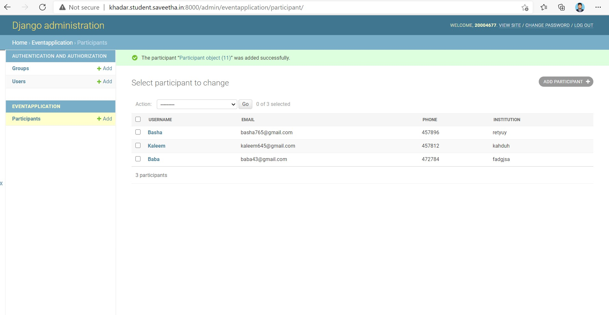

# WebApplication for Event Registration

## AIM:
To create a UX design and develop a web application for event registration.
## DESIGN STEPS:

## DESIGN SCREENS:


## WIREFRAME:

## PROTOTYPE:


## PROGRAM:
### HOME:
```
<!doctype html>
<html lang="en">

<head>
    <!-- Required meta tags -->
    <meta charset="utf-8">
    <meta name="viewport" content="width=device-width, initial-scale=1, shrink-to-fit=no">

    <!-- Bootstrap CSS -->
    <link rel="stylesheet" href="https://maxcdn.bootstrapcdn.com/bootstrap/4.0.0/css/bootstrap.min.css"
        integrity="sha384-Gn5384xqQ1aoWXA+058RXPxPg6fy4IWvTNh0E263XmFcJlSAwiGgFAW/dAiS6JXm" crossorigin="anonymous">

    <title>Home</title>
</head>

<body>
    <div class="jumbotron jumbotron-fluid">
        <div class="container text-center">
             <h1 class="display-4">WORKING ON DANCE</h1>
            <p class="lead">DANCE TO EXPRESS NOT TO IMPRESS</p>
            <hr class="my-4">
        </div>
    </div>
    <div class="container text-center">
        <div class='row '>
        </div>
        <a href="/register/" class="btn btn-primary btn-lg" role="button">Register</a>
    </div>

    <script src="https://code.jquery.com/jquery-3.2.1.slim.min.js"
        integrity="sha384-KJ3o2DKtIkvYIK3UENzmM7KCkRr/rE9/Qpg6aAZGJwFDMVNA/GpGFF93hXpG5KkN"
        crossorigin="anonymous"></script>
    <script src="https://cdnjs.cloudflare.com/ajax/libs/popper.js/1.12.9/umd/popper.min.js"
        integrity="sha384-ApNbgh9B+Y1QKtv3Rn7W3mgPxhU9K/ScQsAP7hUibX39j7fakFPskvXusvfa0b4Q"
        crossorigin="anonymous"></script>
    <script src="https://maxcdn.bootstrapcdn.com/bootstrap/4.0.0/js/bootstrap.min.js"
        integrity="sha384-JZR6Spejh4U02d8jOt6vLEHfe/JQGiRRSQQxSfFWpi1MquVdAyjUar5+76PVCmYl"
        crossorigin="anonymous"></script>
</body>

</html>
```
### REGISTER:
```
<!doctype html>
<html lang="en">

<head>
    <!-- Required meta tags --> 
    <meta charset="utf-8">
    <meta name="viewport" content="width=device-width, initial-scale=1, shrink-to-fit=no">

    <!-- Bootstrap CSS -->
    <link rel="stylesheet" href="https://maxcdn.bootstrapcdn.com/bootstrap/4.0.0/css/bootstrap.min.css"
        integrity="sha384-Gn5384xqQ1aoWXA+058RXPxPg6fy4IWvTNh0E263XmFcJlSAwiGgFAW/dAiS6JXm" crossorigin="anonymous">

    <title>Registration Page</title>
</head>

<body>
    <div class="jumbotron jumbotron-fluid">
        <div class="container text-center">
            <h1 class="display-4">WORKING ON DANCE</h1>
            <p class="lead">DANCE TO EXPRESS NOT TO IMPRESS</p>
            <hr class="my-4">
        </div>
    </div>
    <div class="container ">
        <div class="col-12 ">
            <form action="" method="POST">
                
                <div class="form-group">
                    <label for="name">Name</label>
                    <input type="text" class="form-control" id="username" placeholder="Enter your Name" name="username">
                </div>
                <div class="form-group">
                    <label for="institute">Institute</label>
                    <input type="text" class="form-control" id="institute" name="institute"
                        placeholder="Enter the Name of the institute">
                </div>

                <div class="form-group">
                    <label for="emailid">Email address</label>
                    <input type="email" class="form-control" id="emailid" name="emailid" placeholder="Enter email">
                </div>
                <div class="form-group">
                    <label for="number">Contact Number</label>
                    <input type="number" class="form-control" id="phnumber" name="phnumber" placeholder="Contact Number">
                </div>
         <button type="submit" class="btn btn-primary btn-lg">Submit</button>
        <a href="/home/" class="btn btn-primary btn-lg" role="button">Home</a>

            </form>
        </div>
    </div>

    <script src="https://code.jquery.com/jquery-3.2.1.slim.min.js"
        integrity="sha384-KJ3o2DKtIkvYIK3UENzmM7KCkRr/rE9/Qpg6aAZGJwFDMVNA/GpGFF93hXpG5KkN"
        crossorigin="anonymous"></script>
    <script src="https://cdnjs.cloudflare.com/ajax/libs/popper.js/1.12.9/umd/popper.min.js"
        integrity="sha384-ApNbgh9B+Y1QKtv3Rn7W3mgPxhU9K/ScQsAP7hUibX39j7fakFPskvXusvfa0b4Q"
        crossorigin="anonymous"></script>
    <script src="https://maxcdn.bootstrapcdn.com/bootstrap/4.0.0/js/bootstrap.min.js"
        integrity="sha384-JZR6Spejh4U02d8jOt6vLEHfe/JQGiRRSQQxSfFWpi1MquVdAyjUar5+76PVCmYl"
        crossorigin="anonymous"></script>
</body>

</html>
```
### SUCCESS:
```
<!doctype html>
<html lang="en">
 
<head>
    <!-- Required meta tags -->
    <meta charset="utf-8">
    <meta name="viewport" content="width=device-width, initial-scale=1, shrink-to-fit=no">

    <!-- Bootstrap CSS -->
    <link rel="stylesheet" href="https://maxcdn.bootstrapcdn.com/bootstrap/4.0.0/css/bootstrap.min.css"
        integrity="sha384-Gn5384xqQ1aoWXA+058RXPxPg6fy4IWvTNh0E263XmFcJlSAwiGgFAW/dAiS6JXm" crossorigin="anonymous">

    <title>Success</title>
</head>

<body>
    <div class="jumbotron jumbotron-fluid">
        <div class="container text-center">
             <h1 class="display-4">WORKING ON DANCE</h1>
            <p class="lead">DANCE TO EXPRESS NOT TO IMPRESS</p>
            <hr class="my-4">
        </div>
    </div>
    <div class="container text-center ">
            <h1 >Successfully Registered!</h1>
        <a href="/home/" class="btn btn-primary" role="button">Home</a>

    </div>

    <script src="https://code.jquery.com/jquery-3.2.1.slim.min.js"
        integrity="sha384-KJ3o2DKtIkvYIK3UENzmM7KCkRr/rE9/Qpg6aAZGJwFDMVNA/GpGFF93hXpG5KkN"
        crossorigin="anonymous"></script>
    <script src="https://cdnjs.cloudflare.com/ajax/libs/popper.js/1.12.9/umd/popper.min.js"
        integrity="sha384-ApNbgh9B+Y1QKtv3Rn7W3mgPxhU9K/ScQsAP7hUibX39j7fakFPskvXusvfa0b4Q"
        crossorigin="anonymous"></script>
    <script src="https://maxcdn.bootstrapcdn.com/bootstrap/4.0.0/js/bootstrap.min.js"
        integrity="sha384-JZR6Spejh4U02d8jOt6vLEHfe/JQGiRRSQQxSfFWpi1MquVdAyjUar5+76PVCmYl"
        crossorigin="anonymous"></script>
</body>

</html>
```
### FAILED:
```
<!doctype html>
<html lang="en">
 
<head>
    <!-- Required meta tags -->
    <meta charset="utf-8">
    <meta name="viewport" content="width=device-width, initial-scale=1, shrink-to-fit=no">

    <!-- Bootstrap CSS -->
    <link rel="stylesheet" href="https://maxcdn.bootstrapcdn.com/bootstrap/4.0.0/css/bootstrap.min.css"
        integrity="sha384-Gn5384xqQ1aoWXA+058RXPxPg6fy4IWvTNh0E263XmFcJlSAwiGgFAW/dAiS6JXm" crossorigin="anonymous">

    <title>Registration Page!</title>
</head>

<body>
    <div class="jumbotron jumbotron-fluid">
        <div class="container text-center">
            <h1 class="display-8">WORKSHOP ON BIG DATA</h1>
        </div>
    </div>
    <div class="container text-center ">
        <h1 >fail</h1>
        <a href="/home/" class="btn btn-primary btn-lg" role="button">Home</a>

    </div>

    <script src="https://code.jquery.com/jquery-3.2.1.slim.min.js"
        integrity="sha384-KJ3o2DKtIkvYIK3UENzmM7KCkRr/rE9/Qpg6aAZGJwFDMVNA/GpGFF93hXpG5KkN"
        crossorigin="anonymous"></script>
    <script src="https://cdnjs.cloudflare.com/ajax/libs/popper.js/1.12.9/umd/popper.min.js"
        integrity="sha384-ApNbgh9B+Y1QKtv3Rn7W3mgPxhU9K/ScQsAP7hUibX39j7fakFPskvXusvfa0b4Q"
        crossorigin="anonymous"></script>
    <script src="https://maxcdn.bootstrapcdn.com/bootstrap/4.0.0/js/bootstrap.min.js"
        integrity="sha384-JZR6Spejh4U02d8jOt6vLEHfe/JQGiRRSQQxSfFWpi1MquVdAyjUar5+76PVCmYl"
        crossorigin="anonymous"></script>
</body>

</html>
```
### LISTOFPARTICIPANTS:
```
<!doctype html>
<html lang="en">

<head>
    <!-- Required meta tags -->
    <meta charset="utf-8">
    <meta name="viewport" content="width=device-width, initial-scale=1, shrink-to-fit=no">

    <!-- Bootstrap CSS -->
    <link rel="stylesheet" href="https://maxcdn.bootstrapcdn.com/bootstrap/4.0.0/css/bootstrap.min.css"
        integrity="sha384-Gn5384xqQ1aoWXA+058RXPxPg6fy4IWvTNh0E263XmFcJlSAwiGgFAW/dAiS6JXm" crossorigin="anonymous">

    <title>List of Participants</title>
</head>

<body>
    <div class="jumbotron jumbotron-fluid">
        <div class="container text-center">
             <h1 class="display-4">WORKING ON DANCE</h1>
            <p class="lead">DANCE TO EXPRESS NOT TO IMPRESS</p>
            <hr class="my-4">
        </div>
    </div>
    <div class="container" style=color:beige>
        <table class="table  table-striped table-dark" style=color:beige>
            <thead>
                <tr>
                    <th scope="col">Name</th>
                    <th scope="col">Email</th>
                    <th scope="col">Contact number</th>
                    <th scope="col">Institute</th>

                </tr>
            </thead>
            <tbody>
                

                <tr >
                    <td>{{col.username}}</td>
                    <td>{{col.email}}</td>
                    <td>{{col.phone}}</td>
                    <td>{{col.institution}}</td>

                </tr>
                


            </tbody>
        </table>
    </div>

    <!-- Optional JavaScript -->
    <!-- jQuery first, then Popper.js, then Bootstrap JS -->
    <script src="https://code.jquery.com/jquery-3.2.1.slim.min.js"
        integrity="sha384-KJ3o2DKtIkvYIK3UENzmM7KCkRr/rE9/Qpg6aAZGJwFDMVNA/GpGFF93hXpG5KkN"
        crossorigin="anonymous"></script>
    <script src="https://cdnjs.cloudflare.com/ajax/libs/popper.js/1.12.9/umd/popper.min.js"
        integrity="sha384-ApNbgh9B+Y1QKtv3Rn7W3mgPxhU9K/ScQsAP7hUibX39j7fakFPskvXusvfa0b4Q"
        crossorigin="anonymous"></script>
    <script src="https://maxcdn.bootstrapcdn.com/bootstrap/4.0.0/js/bootstrap.min.js"
        integrity="sha384-JZR6Spejh4U02d8jOt6vLEHfe/JQGiRRSQQxSfFWpi1MquVdAyjUar5+76PVCmYl"
        crossorigin="anonymous"></script>
</body>

</html>
```
### MODELS.PY:
```
from django.db import models

# Create your models here.
from django.contrib import admin
class Participant(models.Model):
    username=models.CharField(max_length=50)
    email=models.CharField(max_length=50)
    phone=models.CharField(max_length=50)
    institution=models.CharField(max_length=50)

class ParticipantAdmin(admin.ModelAdmin):
    list_display=("username","email","phone","institution")
```
### VIEWS.PY:
```
from django.shortcuts import render
from .models import Participant
from django.core.exceptions import ValidationError

# Create your views here.
def home(request):
    context = {}
    return render(request, 'eventapplication/home.html', context)

def register(request):
    context = {}

    if request.method == 'POST':
        p1=Participant()
        p1.username = request.POST.get('username','-')
        p1.email = request.POST.get('email','-')
        p1.phone = request.POST.get('phone','000')
        p1.institution = request.POST.get('institution','-')

        if len(Participant.objects.all()) > 15:
            return render (request, 'eventappliction/failed.html',context)

        else:
            p1.save()
            return render (request, 'eventapplication/success.html',context)

    if request.method == 'GET':
        context['username'] = ''
        context['email'] = ''
        context['phone'] = ''
        context['institution'] = ''

    return render(request, 'eventapplication/register.html', context)

def listofparticipants(request):
    context = {}

    context['Participants'] = Participant.objects.all()

    return render(request, 'eventapplication/listofparticipants.html', context)

def success(request):
    context = {}
    return render(request, 'eventapplication/success.html', context)

def failed(request):
    context = {}
    return render(request, 'eventapplication/failed.html', context)
```
## OUTPUT:





## RESULT:
Thus, a UX design and develop a web application for event registration has been done.
