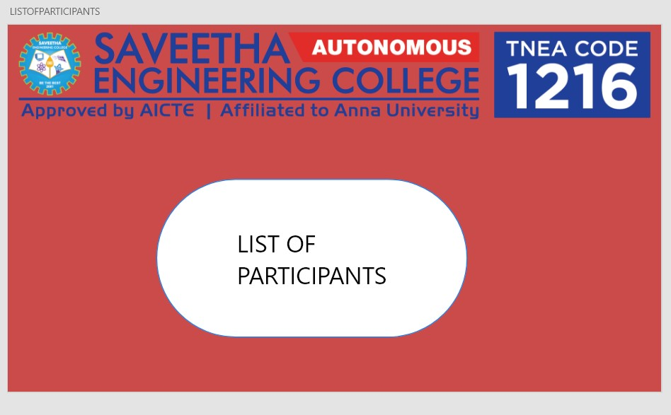

# WebApplication for Event Registration

## AIM:
To create a UX design and develop a web application for event registration.
## DESIGN STEPS:

## DESIGN SCREENS:

## WIREFRAME:

## PROTOTYPE:

## PROGRAM:

## OUTPUT:

## RESULT:
Thus, a UX design and develop a web application for event registration has been done.
